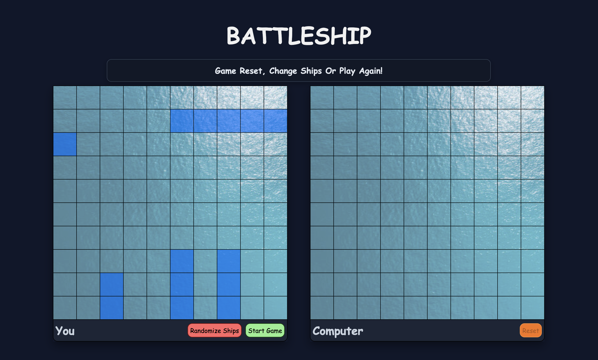
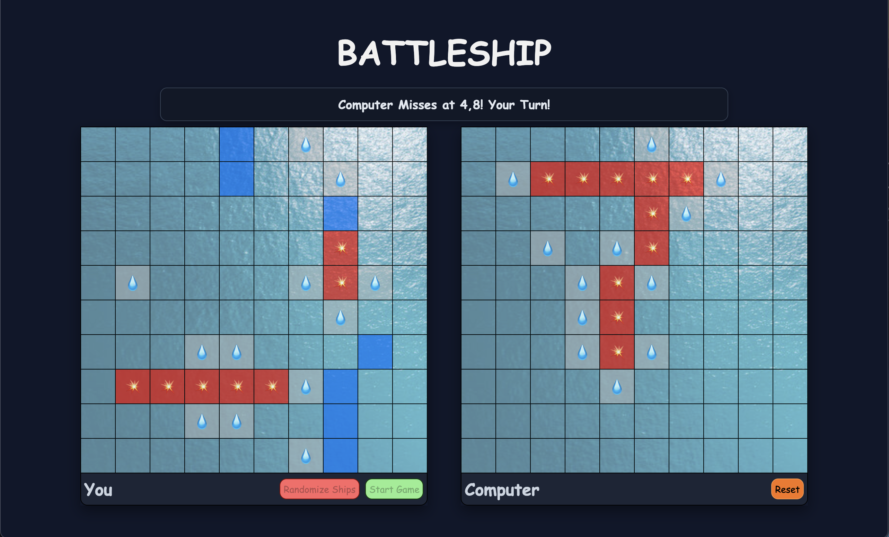

# Battleship

A Fun Recreation of the Popular Game Battleship.

This project I focused on TDD (Test driven Development) and making the Battleship AI fun while thinking about Complexity and the most optimized ways to do things.

## Features

- Randomize your Ships
- Attack the Enemy board by clicking on the Grid!
- Reset the game at any point if you want a new ship setup!
- Smart Computer that will use a type of BFS to find your ships!
- Clean and Modern UI

[Live Demo](https://raihancarder.github.io/battleship/)

## Screenshots

## Prerequisites

- [Node.js](https://nodejs.org/) (v14 or higher recommended)
- npm (comes with Node)

## Installation

1. Clone the repo  
   `git clone https://github.com/raihanCarder/battleship.git`

2. Navigate to the folder  
   `cd battleship`

3. Install Dependencies with `npm install` in terminal.

4. Build Project with `npm run build` in terminal.

5. Open dist/index.html in browser or preview with VS Live Server.

## Tech Stack

- Javascript
- HTML
- CSS
- Webpack
- Jest

Created by Raihan Carder(https://github.com/raihanCarder)  
Feel free to reach out!
